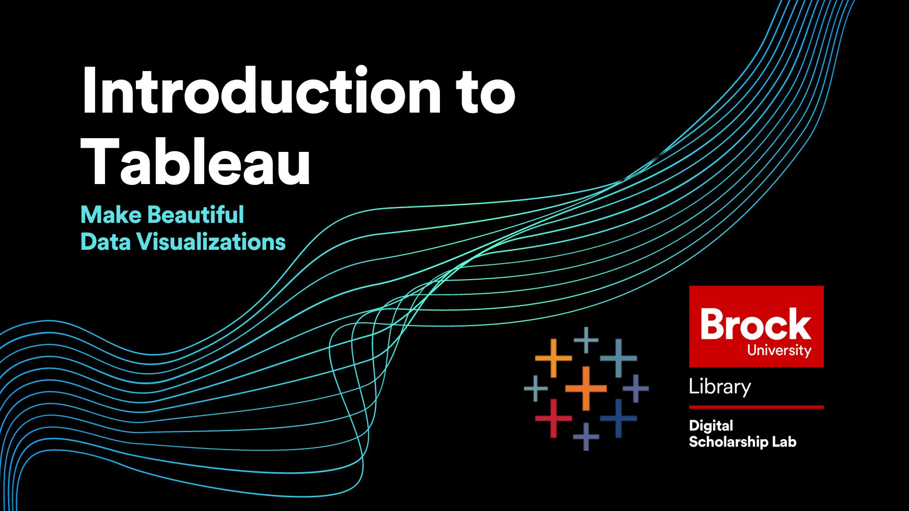

# Introduction to Tableau Part 1
This workshop will introduce the most basic functions of Tableau Public such as connecting to a dataset and building sheets, dashboards, and story's.  This session will also cover how to publish your work to Tableau Public Online and how to share and download it from there.

No prior experience with Tableau is needed for this workshop.

*Estimated workshop length: 2.5 hours*

----

## Setup Instructions
In preparation for this workshop, you will need to download and install the latest version of Tableau Public which can be done using the link below (keep in mind that you may need to contact your institution for permission to install programs).
  
[Download Tableau Public](https://public.tableau.com/s/download/public/pc64)

You will also need to download the two excel workbooks used in this workshop by using the links below:

[Dataset 1 - Mahogany Mary Sales Data](https://github.com/BrockDSL/Introduction-To-Tableau-Part-1/raw/master/Workshop%20Datasets/Mahogany%20Mary%202018%20Sales%20Data.xlsx)  
  
[Dataset 2 - Customer Satisfaction Data](https://github.com/BrockDSL/Introduction-To-Tableau-Part-1/raw/master/Workshop%20Datasets/Customer%20Satisfaction%20Mahogany%20Mary%202018.xlsx)

----

## Workshop Tasks (Currently being rewritten per attendee feedback!)
**Task Set 1**

**Task Set 2**

**Task Set 3** 

----

**This workshop is brought to you by the Brock University Digital Scholarship Lab.  For a listing of our upcoming workshops go to [Experience BU](https://experiencebu.brocku.ca/organization/dsl) if you are a Brock affiliate or our [Eventbrite page](https://www.eventbrite.ca/o/brock-university-digital-scholarship-lab-21661627350) for external attendees.  For additional inquiries, contact [DSL@Brocku.ca](mailto:DSL@Brocku.ca)**

